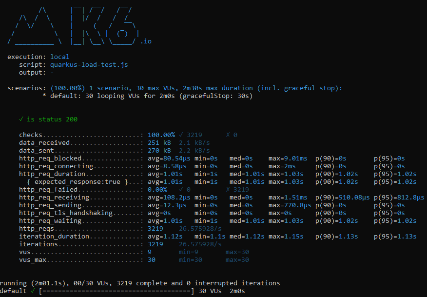
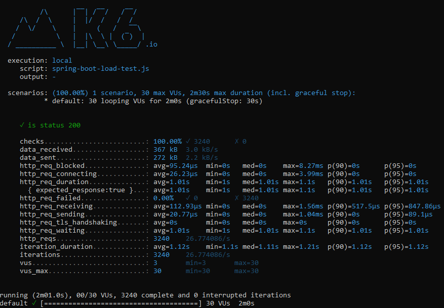

# Load Tests

This directory contains the k6 load test scripts which will be used for load testing the web apps found in the parent directory.

> Before running the tests, make sure that you have the applications up and running.

## Prerequisites

1. Before running the following command make sure that you have the [k6](https://k6.io/) load testing tool installed on your machine.

2. Verify if the ports from the script files match the ports that you are using in your application instances. These load tests are using the following ports:

   1. Spring Boot = **8080**
   2. Quarkus = **8081**
   3. Golang = **8082**

## Spring Boot Load Testing

```shell
k6 run --vus 30 --duration 120s spring-boot-load-test.js
```

## Quarkus Load Testing

```shell
k6 run --vus 30 --duration 120s quarkus-load-test.js
```

## Golang Load Testing

```shell
k6 run --vus 30 --duration 120s golang-load-test.js
```

## Load Testing Results

All following images represent the K6 load testing results for all projects.
These tests were executed using 30 Virtual Users over 120 seconds.

Environment setup:

1. Windows 11 Pro 21H2
2. Amazon Corretto-21.0.0.35.1, Apache Maven 3.8.4, GraalVM CE 22.2.0
3. 16GB RAM
4. I7-11800H 8 cores

### Golang


### Quarkus



### Spring Boot


